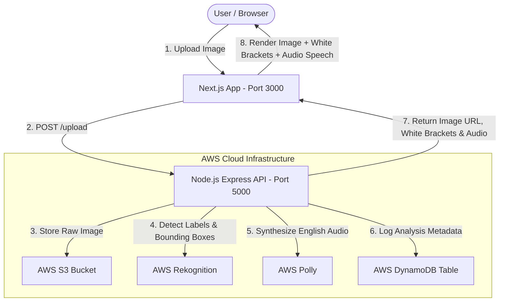

# 🚀 AI Image Vision & Voice Analyzer

### AWS Cloud-Native Full-Stack Application

> **AI-powered image analysis** using AWS Rekognition for object detection with visual bounding boxes, AWS Polly for text-to-speech narration, and DynamoDB for persistent history — all provisioned via Terraform IaC.

---

## 📌 Project Overview

The **AI Image Vision & Voice Analyzer** is a production-ready, cloud-native application that allows users to upload images through a modern web interface. The system automatically:

1. **Stores images** in an AWS S3 bucket
2. **Detects objects and labels** using AWS Rekognition with 2D bounding box coordinates
3. **Highlights detected objects** with white square bracket overlays on the image
4. **Generates natural English speech** describing the image contents using AWS Polly
5. **Logs analysis metadata** (user ID, image URL, labels, timestamp) to AWS DynamoDB
6. **Provisions all cloud resources** via HashiCorp Terraform (Infrastructure as Code)

---

## 🏗️ System Architecture

```
┌──────────────────────────────────────────────────────────────────────┐
│                         USER / BROWSER                               │
│                                                                      │
│   1. Select & Upload Images ──────►  2. View Results + Listen Audio  │
└───────────┬──────────────────────────────────────▲───────────────────┘
            │                                      │
            ▼                                      │
┌───────────────────────────────────────────────────────────────────────┐
│                    FRONTEND (Next.js 16 - Port 3000)                  │
│                                                                       │
│   • Drag & Drop Image Upload       • White Square Bracket Overlays    │
│   • Local Image Previews           • Audio Player (AWS Polly Speech)  │
│   • Responsive Tailwind CSS UI     • DynamoDB Save Status Display     │
│                                                                       │
│   POST /upload (multipart/form-data) ──────────────────────┐          │
│   ◄──── JSON Response (imageUrl, labels, objects, audioUrl)│          │
└───────────┬────────────────────────────────────────────────┘──────────┘
            │
            ▼
┌───────────────────────────────────────────────────────────────────────┐
│                    BACKEND (Node.js Express - Port 5000)               │
│                                                                        │
│   routes/upload.js ──► Receives images via Multer (max 10)             │
│                                                                        │
│   Step 1: s3services.js ──────────► Upload to AWS S3 Bucket            │
│   Step 2: rekognitionService.js ──► Detect Labels & Bounding Boxes     │
│   Step 3: dynamoService.js ───────► Save Metadata to DynamoDB          │
│   Step 4: pollyService.js ────────► Generate English Speech (MP3)      │
│   Step 5: Return JSON response with all results                        │
│                                                                        │
│   All images processed in parallel via Promise.all()                   │
└───────────┬────────────────────────────────────────────────────────────┘
            │
            ▼
┌───────────────────────────────────────────────────────────────────────┐
│                    AWS CLOUD SERVICES (Provisioned via Terraform)       │
│                                                                        │
│   ┌─────────────┐  ┌──────────────────┐  ┌─────────────┐              │
│   │   AWS S3     │  │ AWS Rekognition   │  │  AWS Polly  │              │
│   │ Image Store  │  │ Label Detection   │  │ Text-to-    │              │
│   │             │  │ Bounding Boxes    │  │ Speech      │              │
│   └─────────────┘  └──────────────────┘  └─────────────┘              │
│                                                                        │
│   ┌──────────────┐  ┌──────────────────┐  ┌──────────────┐             │
│   │ AWS DynamoDB │  │  AWS IAM          │  │  AWS VPC     │             │
│   │ History Logs │  │  Roles & Policies │  │  & EC2       │             │
│   └──────────────┘  └──────────────────┘  └──────────────┘             │
└────────────────────────────────────────────────────────────────────────┘
```



---

## 🔄 Complete Workflow (Step-by-Step)

### Phase 1: Infrastructure Provisioning (Terraform)

```
Developer Machine
      │
      ├── terraform init          → Downloads AWS provider plugins
      ├── terraform plan          → Previews all resources to create
      └── terraform apply         → Provisions the following AWS resources:
            │
            ├── S3 Bucket               (Image storage with public read + CORS)
            ├── DynamoDB Table          (NoSQL history: pk=userId, sk=timestamp)
            ├── IAM Policy              (S3 + Rekognition + Polly + DynamoDB access)
            ├── IAM Role                (EC2 instance profile for production)
            ├── IAM User + Access Key   (For local development .env credentials)
            ├── VPC + Subnet + IGW      (Network isolation for EC2 hosting)
            ├── Security Group          (Ports: 22, 80, 3000, 5000)
            └── EC2 Instance (Optional) (Ubuntu 22.04 with Node.js pre-installed)
```

### Phase 2: Backend Processing Pipeline

```
User uploads image(s) via browser
      │
      ▼
POST /upload (multipart/form-data, max 10 images)
      │
      ▼
┌─────────────────── For EACH image (parallel via Promise.all) ───────────┐
│                                                                          │
│  Step 1: S3 Upload                                                       │
│  ├── Read file from local temp storage (Multer)                          │
│  ├── Generate unique S3 key: uploads/{uuid}-{originalname}               │
│  ├── Upload to S3 bucket with correct ContentType                        │
│  ├── Delete local temp file                                              │
│  └── Return public S3 URL                                                │
│                                                                          │
│  Step 2: AWS Rekognition Analysis                                        │
│  ├── Extract S3 key from the public URL                                  │
│  ├── Call rekognition.detectLabels() with MaxLabels=10, MinConfidence=60  │
│  ├── Extract label names (e.g., "Person", "Tree", "Car")                 │
│  └── Extract bounding box instances {Width, Height, Left, Top}           │
│                                                                          │
│  Step 3: DynamoDB History Logging                                        │
│  ├── Compose item: {pk: userId, sk: timestamp, imageUrl, labels}         │
│  └── Put item to DynamoDB table (gracefully handles errors)              │
│                                                                          │
│  Step 4: AWS Polly Speech Synthesis                                      │
│  ├── Generate English sentence: "This image contains: label1, label2..." │
│  ├── Call polly.synthesizeSpeech() with VoiceId="Joanna", format=MP3     │
│  ├── Save .mp3 file locally: audio-{uuid}.mp3                           │
│  └── Return audio URL: http://localhost:5000/audio-{uuid}.mp3            │
│                                                                          │
│  Return per-image result:                                                │
│  { imageUrl, labels[], objects[], audioUrl, dbSaved, dbError }           │
│                                                                          │
└──────────────────────────────────────────────────────────────────────────┘
      │
      ▼
JSON Response Array → Frontend
```

### Phase 3: Frontend Rendering

```
Frontend receives JSON response
      │
      ▼
For each analyzed image:
      │
      ├── Display the image from S3 URL
      ├── Overlay white square bracket bounding boxes on detected objects
      │     ├── Position: CSS absolute with %, from BoundingBox {Left, Top, Width, Height}
      │     ├── Corner bracket ticks (4 corners)
      │     └── Label pill: [ObjectName] confidence%
      ├── Interactive object buttons (hover highlights corresponding bounding box)
      ├── Auto-play English audio narration from AWS Polly
      ├── Display detected categories as tags
      └── Show DynamoDB save status (✓ Saved / ✗ Not Saved)
```

---

## ✨ Features

| Feature                              | Description                                                               |
| ------------------------------------ | ------------------------------------------------------------------------- |
| 🖼️**Multi-Image Upload**     | Drag & drop up to 10 images with instant local thumbnails                 |
| 🔲**Bounding Box Overlays**    | White square bracket visual highlighting over detected physical objects   |
| 🔊**AI Speech Synthesis**      | Automatic English audio narration describing image contents via AWS Polly |
| 🗄️**History Logging**        | Persistent serverless logs in DynamoDB (queryable by user ID)             |
| ⚡**Parallel Processing**      | High-throughput multi-image processing using`Promise.all()`             |
| 🌿**Minimalist UI**            | Clean, responsive interface with Next.js 16 + Tailwind CSS                |
| 🏗️**Infrastructure as Code** | Single-command cloud provisioning with Terraform                          |
| 🔒**IAM Least Privilege**      | Fine-grained IAM policies for S3, Rekognition, Polly, DynamoDB            |
| 🌐**VPC Networking**           | Custom VPC with public subnet, IGW, and security groups                   |
| 🖥️**Optional EC2 Hosting**   | Terraform-provisioned Ubuntu EC2 with Node.js for production deployment   |

---

## ⚙️ Tech Stack

| Layer                    | Technology                                                     |
| ------------------------ | -------------------------------------------------------------- |
| **Frontend**       | Next.js 16 (React 19, TypeScript, Tailwind CSS 4)              |
| **Backend**        | Node.js, Express.js 5, Multer                                  |
| **AI/ML**          | AWS Rekognition (Object Detection), AWS Polly (Text-to-Speech) |
| **Storage**        | AWS S3 (Images), AWS DynamoDB (Metadata History)               |
| **Infrastructure** | HashiCorp Terraform (>= 1.3.0), AWS Provider ~> 5.0            |
| **Networking**     | AWS VPC, Subnet, Internet Gateway, Security Groups             |
| **Compute**        | AWS EC2 (Optional, Ubuntu 22.04 LTS)                           |

---

## 🚀 Getting Started

### Prerequisites

- **Node.js** v18 or higher ([Download](https://nodejs.org/))
- **AWS Account** with active credentials
- **Terraform** >= 1.3.0 ([Download](https://www.terraform.io/downloads))
- **Git** installed

---

### Step 1: Clone the Repository

```bash
git clone https://github.com/Devjivani1606/ai-image-analyzer.git
cd ai-image-analyzer
```

---

### Step 2: Provision AWS Infrastructure (Terraform)

```bash
cd terraform
```

**2a. Initialize Terraform** (downloads AWS provider plugins):

```bash
terraform init
```

**2b. Review the execution plan**:

```bash
terraform plan
```

**2c. Apply and provision all resources**:

```bash
terraform apply
```

> Type `yes` when prompted to confirm.

**2d. Generate backend `.env` credentials**:

```bash
terraform output -raw backend_dotenv_template
```

> Copy the output to use in Step 3.

**Resources Created:**

| Resource           | Purpose                                                         |
| ------------------ | --------------------------------------------------------------- |
| S3 Bucket          | Image storage with public read access & CORS                    |
| DynamoDB Table     | `ImageAnalysis` table (pk: userId, sk: timestamp)             |
| IAM Policy         | Least-privilege access to S3, Rekognition, Polly, DynamoDB      |
| IAM User + Key     | Access credentials for local development                        |
| IAM Role + Profile | EC2 instance role for production deployment                     |
| VPC + Subnet + IGW | Network isolation with internet access                          |
| Security Group     | Inbound: ports 22, 80, 3000, 5000. Outbound: all                |
| EC2 Instance       | Optional Ubuntu 22.04 server with Node.js (toggle via variable) |

---

### Step 3: Run the Backend API Server

```bash
cd backend
```

**3a. Create the `.env` file** with your AWS credentials:

```env
AWS_ACCESS_KEY_ID=your_access_key
AWS_SECRET_ACCESS_KEY=your_secret_key
AWS_REGION=ap-south-1
S3_BUCKET_NAME=your_s3_bucket_name
DYNAMODB_TABLE_NAME=ImageAnalysis
```

> 💡 You can paste the output from `terraform output -raw backend_dotenv_template` directly.

**3b. Install dependencies and start the server**:

```bash
npm install
npm start
```

✅ Backend runs on **http://localhost:5000**

---

### Step 4: Run the Frontend Web App

```bash
cd frontend
```

**4a. Install dependencies and start dev server**:

```bash
npm install
npm run dev
```

✅ Frontend runs on **http://localhost:3000**

---

### Step 5: Use the Application

1. Open **http://localhost:3000** in your browser
2. Click or drag images into the upload zone
3. Click **"Upload & Analyze Image"**
4. View results:
   - 🖼️ Analyzed image with white square bracket overlays on detected objects
   - 🔊 Auto-playing English audio narration
   - 🏷️ Detected object buttons (hover to highlight corresponding bounding box)
   - 📊 Categories list
   - ✅ DynamoDB save status

---

## 📡 API Reference

### `POST /upload`

Upload and analyze images.

| Parameter  | Type       | Description                                          |
| ---------- | ---------- | ---------------------------------------------------- |
| `images` | `File[]` | Image files (max 10), sent as`multipart/form-data` |

**Response:**

```json
[
  {
    "imageUrl": "https://s3.ap-south-1.amazonaws.com/bucket/uploads/uuid-filename.jpg",
    "labels": ["Person", "Tree", "Outdoor", "Nature", "Park"],
    "objects": [
      {
        "name": "Person",
        "confidence": 99,
        "boundingBox": {
          "Width": 0.25,
          "Height": 0.50,
          "Left": 0.10,
          "Top": 0.20
        }
      }
    ],
    "audioUrl": "http://localhost:5000/audio-uuid.mp3",
    "dbSaved": true,
    "dbError": null
  }
]
```

---

### `GET /upload/history`

Retrieve analysis history from DynamoDB.

| Parameter  | Type               | Default       | Description               |
| ---------- | ------------------ | ------------- | ------------------------- |
| `userId` | `string` (query) | `demo-user` | Filter history by user ID |

**Response:**

```json
[
  {
    "pk": "demo-user",
    "sk": "2026-10-05T04:14:34.000Z",
    "userId": "demo-user",
    "imageUrl": "https://s3.ap-south-1.amazonaws.com/bucket/uploads/image.jpg",
    "labels": ["Person", "Tree"],
    "createdAt": "2026-10-05T04:14:34.000Z"
  }
]
```

---

## 📁 Project Directory Structure

```
ai-image-analyzer/
│
├── README.md                         # This file — full project documentation
├── .gitignore                        # Git ignore rules
├── .env                              # Root environment variables (git-ignored)
│
├── backend/                          # Node.js & Express API Server
│   ├── server.js                     # Entry point — Express app setup (port 5000)
│   ├── package.json                  # Backend dependencies
│   ├── .env                          # Backend AWS credentials (git-ignored)
│   ├── config/
│   │   └── aws.js                    # AWS SDK configuration (credentials + region)
│   ├── routes/
│   │   └── upload.js                 # POST /upload & GET /upload/history endpoints
│   ├── services/
│   │   ├── s3services.js             # S3 file upload (UUID key, cleanup temp files)
│   │   ├── rekognitionService.js     # Rekognition label + bounding box detection
│   │   ├── pollyService.js           # Polly text-to-speech (MP3 generation)
│   │   └── dynamoService.js          # DynamoDB put/query for analysis history
│   └── uploads/                      # Temporary Multer upload directory
│
├── frontend/                         # Next.js 16 Web Application
│   ├── app/
│   │   ├── layout.tsx                # Root layout (Geist font, Tailwind)
│   │   ├── page.tsx                  # Main UI — upload, results, bounding boxes
│   │   ├── globals.css               # Global Tailwind CSS styles
│   │   └── favicon.ico               # App favicon
│   ├── package.json                  # Frontend dependencies
│   ├── next.config.ts                # Next.js configuration
│   ├── tsconfig.json                 # TypeScript configuration
│   └── postcss.config.mjs            # PostCSS + Tailwind plugin
│
└── terraform/                        # Infrastructure as Code (AWS)
    ├── main.tf                       # Terraform & provider configuration
    ├── variables.tf                  # Input variables (region, project name, etc.)
    ├── s3.tf                         # S3 bucket, CORS, public access policy
    ├── dynamodb.tf                   # DynamoDB table (pk + sk schema)
    ├── iam.tf                        # IAM policy, role, user, access keys
    ├── vpc.tf                        # VPC, subnet, IGW, route table, security group
    ├── ec2.tf                        # EC2 instance (optional, Ubuntu 22.04)
    ├── outputs.tf                    # Outputs (bucket name, IPs, .env template)
    ├── terraform.tfvars.example      # Example variable overrides
    └── README.md                     # Terraform-specific documentation
```

---
